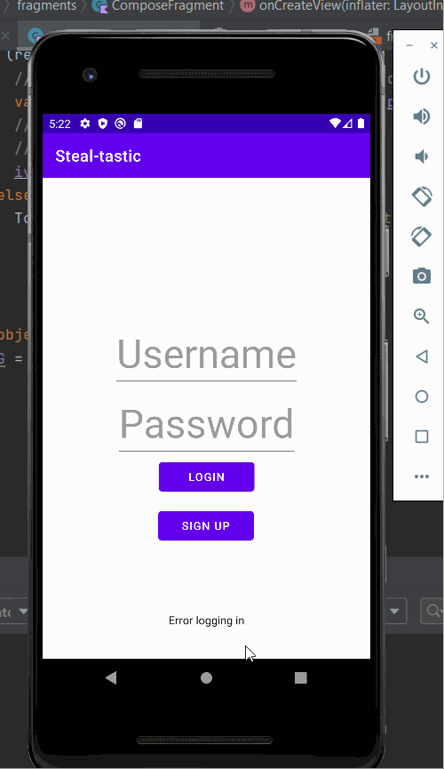
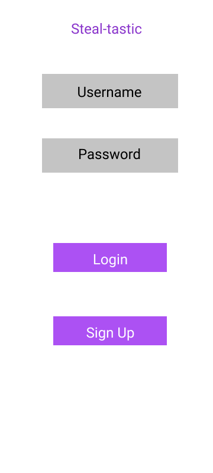
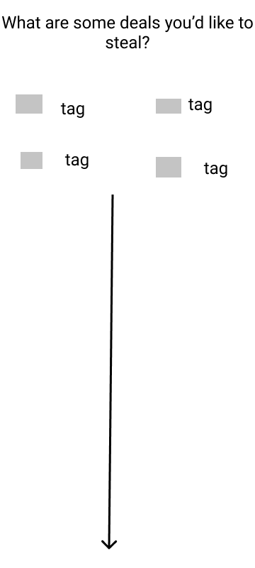
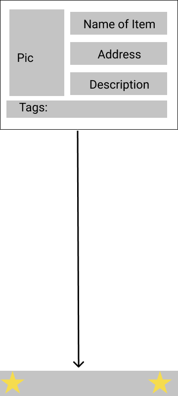
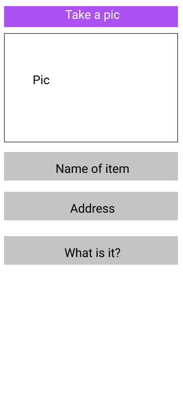
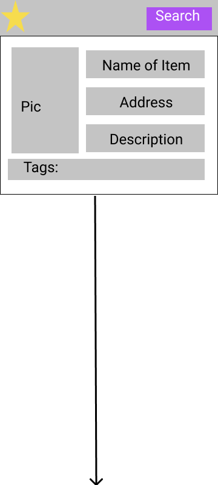

Original App Design Project - README Template
===

# Steal-tastic

## Table of Contents
1. [Overview](#Overview)
2. [Product Spec](#Product-Spec)
3. [Wireframes](#Wireframes)
4. [Schema](#Schema)

## Overview
### Description
A community driven app meant to find and share deals in your area.

### App Evaluation
[Evaluation of your app across the following attributes]
- **Category:**
- **Mobile:**
- **Story:**
- **Market:**
- **Habit:**
- **Scope:**

## Product Spec

### 1. User Stories (Required and Optional)

**Required Must-have Stories**

* User can register a new account
* [X]User can login
* [X]User can make a post using picture, description, address, and add categories
* [X]user can view posts from others
* user can view posts of a specific category

**Optional Nice-to-have Stories**

* User can logout
* google maps autofill
* User can add a picture from saved photos
* User can tap a tag to view more posts of that that type
* User can save posts
* Settings screen

**Progress**
Week 1 Progress

Week 2 Progress

### 2. Screen Archetypes

* Login / Reqister
   * User can register a new account
   * User can login
* Stream
   * User can view posts from others
   * Users can view posts of a specific category
* Creation
   *User can make a post using picture, description, address, and add categories

### 3. Navigation

**Tab Navigation** (Tab to Screen)

* Stream
* Creation

**Flow Navigation** (Screen to Screen)

* Login / Reqister
   * Stream
* Stream
   * Stream
   * Creation
* Creation
   *Stream

## Wireframes

### [BONUS] Interactive Prototype

https://www.figma.com/proto/Hika3OgwIa0pmNEmoHUzaQ/Steal-tastic?node-id=3%3A3&scaling=min-zoom&page-id=0%3A1&starting-point-node-id=3%3A3

## Schema 
[This section will be completed in Unit 9]
### Models
[Add table of models]
### Networking
- [Add list of network requests by screen ]
- [Create basic snippets for each Parse network request]
- [OPTIONAL: List endpoints if using existing API such as Yelp]
